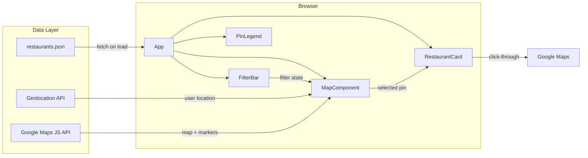

# Technical Architecture Document - Food List

**Author:** Rhunnicutt
**Date:** 2026-03-17
**PRD Reference:** [prd.md](./prd.md)

## Tech Stack

### Frontend Framework: React + Vite + TypeScript

- **React** -- component-based UI, widely used, strong Google Maps ecosystem (`@vis.gl/react-google-maps`). Most transferable skill for future projects.
- **Vite** -- fast dev server with hot reload, builds to static files (HTML/CSS/JS). No backend server required.
- **TypeScript** -- type safety for the restaurant data model. Catches data shape errors at build time rather than runtime.

Alternative: Vanilla JS is viable for this scope, but React makes filter state management and card show/hide cleaner as the app grows.

### Styling: Tailwind CSS

- Utility-first, mobile-responsive by default, fast to iterate.
- No design system needed for a single-page app.
- Responsive breakpoints built in (sm/md/lg prefixes).

### Map: Google Maps JavaScript API

- Loaded via `@vis.gl/react-google-maps` -- the official Google-maintained React wrapper.
- Direct access to all Maps JS API features: markers, info windows, geolocation, map controls.
- Teaches Google Maps API concepts while providing React ergonomics.
- Requires a Google Maps Platform API key (free tier: $200/month credit).

### Data: Static JSON File

- `restaurants.json` loaded via fetch at page init (~200 records, <50KB).
- No database for MVP -- the JSON file IS the database.
- Curator edits the JSON file directly and redeploys.
- Schema is strict and typed via TypeScript interfaces.

### Deployment: Nginx on VPS

- `npm run build` produces a `dist/` folder of static assets.
- Nginx serves the static files on a domain/subdomain alongside existing n8n.
- Deploy via `rsync` or `scp` of the build output to the VPS.

## Architecture Overview



**Data flow:**

1. App loads, fetches `restaurants.json`, stores full dataset in state.
2. Browser Geolocation API provides user's coordinates; map centers on them.
3. Google Maps JS API renders the map and all pins (colored by tier).
4. User interacts with FilterBar -- filter state updates, `useRestaurants` hook recomputes visible subset, map re-renders pins.
5. User clicks a pin -- MapComponent sets selected restaurant, RestaurantCard appears with details.
6. User clicks "Open in Google Maps" on the card -- navigates to external Google Maps page.

## Project Structure

```
food-list/
  public/
    restaurants.json          # Restaurant data (curator maintains this)
  src/
    components/
      Map.tsx                 # Google Map rendering + pin display
      FilterBar.tsx           # Cuisine dropdown + distance slider
      RestaurantCard.tsx      # Detail card shown on pin click
      PinLegend.tsx           # Tier color legend overlay
    hooks/
      useGeolocation.ts       # Browser geolocation wrapper
      useRestaurants.ts       # Load, filter, and expose restaurant data
    types/
      restaurant.ts           # TypeScript interfaces and enums
    utils/
      distance.ts             # Haversine distance calculation
      filters.ts              # Filter logic (cuisine match, distance check)
    App.tsx                   # Root component, composes all pieces
    main.tsx                  # Vite entry point, renders App
  index.html                  # Single HTML page, loads Vite bundle
  package.json
  tsconfig.json
  vite.config.ts
  tailwind.config.js
```

## Data Model

### Restaurant Record Schema

```typescript
type Tier = "loved" | "recommended" | "on_my_radar";

interface Restaurant {
  id: string;                  // URL-safe slug (e.g., "pho-43")
  name: string;                // Display name
  tier: Tier;                  // Curation confidence level
  cuisine: string;             // Primary cuisine type (e.g., "Vietnamese")
  lat: number;                 // Latitude
  lng: number;                 // Longitude
  notes?: string;              // Curator's personal notes (optional)
  googleMapsUrl: string;       // Direct link to Google Maps page
  source?: string;             // How the curator found it (optional)
  dateAdded: string;           // ISO date string (YYYY-MM-DD)
}
```

### Tier Color Mapping

| Tier | Color | Hex | Meaning |
|---|---|---|---|
| `loved` | Gold | `#F59E0B` | Personally tried and loved |
| `recommended` | Blue | `#3B82F6` | Tried and would recommend |
| `on_my_radar` | Green | `#10B981` | Pre-vetted, want to try |

### Sample `restaurants.json`

```json
[
  {
    "id": "pho-43",
    "name": "Pho 43",
    "tier": "loved",
    "cuisine": "Vietnamese",
    "lat": 33.4255,
    "lng": -111.9400,
    "notes": "Try the bone marrow pho. Cash only.",
    "googleMapsUrl": "https://maps.google.com/?cid=12345",
    "source": "friend Dave",
    "dateAdded": "2026-01-15"
  },
  {
    "id": "tanaka-ramen",
    "name": "Tanaka Ramen",
    "tier": "on_my_radar",
    "cuisine": "Japanese",
    "lat": 33.4148,
    "lng": -111.9093,
    "notes": "Saw on @phxfoodie TikTok, try the spicy miso.",
    "googleMapsUrl": "https://maps.google.com/?cid=67890",
    "source": "TikTok @phxfoodie",
    "dateAdded": "2026-03-10"
  }
]
```

### Cuisine Values

Maintained as a derived set from the data (not a separate config). The FilterBar extracts unique `cuisine` values from the loaded dataset to populate the dropdown. No hardcoded list needed.

## Component Architecture

### App.tsx

Root component. Manages top-level state:
- `restaurants: Restaurant[]` -- full dataset loaded from JSON
- `filters: { cuisine: string | null; maxDistance: number | null }` -- active filter state
- `selectedRestaurant: Restaurant | null` -- currently clicked pin
- `userLocation: { lat: number; lng: number } | null` -- from geolocation

Composes: `FilterBar`, `Map`, `RestaurantCard` (conditional), `PinLegend`.

### Map.tsx

Renders the Google Map via `@vis.gl/react-google-maps`. Receives filtered restaurant list as props. Renders one `<AdvancedMarker>` per restaurant, colored by tier. On marker click, calls `onSelect(restaurant)` to surface the detail card.

Map default center: Phoenix metro (~33.4484, -112.0740). If geolocation succeeds, re-centers on user.

### FilterBar.tsx

Renders cuisine dropdown and distance slider. On change, updates filter state in App. Cuisine options derived from loaded data. Distance slider ranges from 5 to 30 miles (or "Any").

### RestaurantCard.tsx

Conditionally rendered when a pin is selected. Displays: name, tier badge (colored), cuisine, curator notes, and a "Open in Google Maps" button linking to `googleMapsUrl`. Dismiss via close button or clicking the map background.

### PinLegend.tsx

Small overlay on the map showing the three tier colors and their meanings. Always visible.

## Filtering Architecture

All filtering is client-side. The full dataset (~200 records) lives in memory after the initial fetch.

### Filter State

```typescript
interface FilterState {
  cuisine: string | null;     // null = all cuisines
  maxDistance: number | null;  // null = any distance, otherwise miles
}
```

### useRestaurants Hook

```typescript
function useRestaurants(
  allRestaurants: Restaurant[],
  filters: FilterState,
  userLocation: { lat: number; lng: number } | null
): Restaurant[] {
  // 1. Filter by cuisine (exact match on cuisine field)
  // 2. Filter by distance (Haversine from userLocation, skip if no location)
  // 3. Return filtered subset
}
```

### Distance Calculation

Haversine formula calculates great-circle distance between two lat/lng points:

```typescript
function getDistanceMiles(
  lat1: number, lng1: number,
  lat2: number, lng2: number
): number {
  // Standard Haversine implementation
  // Returns distance in miles
}
```

Distance filtering requires user geolocation. If geolocation is denied or unavailable, the distance filter is hidden/disabled and only cuisine filtering is available.

### Performance

- ~200 records filtered in <1ms on any modern device.
- No debouncing needed -- filter changes re-render immediately.
- Map marker updates are handled by React reconciliation (only changed markers re-render).

## Google Maps API Integration

### API Key Setup

- Create a project in Google Cloud Console.
- Enable "Maps JavaScript API" (required for MVP).
- Enable "Places API" (for growth phase enrichment).
- Restrict the API key by HTTP referrer (the app's domain) to prevent abuse.
- The free tier provides $200/month credit -- more than sufficient for this usage.

### Map Initialization

The `@vis.gl/react-google-maps` library handles loading the Maps JS API script. Configuration:

```typescript
<APIProvider apiKey={GOOGLE_MAPS_API_KEY}>
  <Map
    defaultCenter={{ lat: 33.4484, lng: -112.0740 }}
    defaultZoom={11}
    mapId="food-list-map"
  >
    {filteredRestaurants.map(r => (
      <AdvancedMarker
        key={r.id}
        position={{ lat: r.lat, lng: r.lng }}
        onClick={() => onSelect(r)}
      >
        <Pin background={tierColor(r.tier)} />
      </AdvancedMarker>
    ))}
  </Map>
</APIProvider>
```

### Geolocation

Browser Geolocation API (`navigator.geolocation.getCurrentPosition`) is called once on app load. If the user grants permission, the map re-centers and distance filtering becomes available. If denied, the map defaults to a Phoenix-wide view and distance filtering is hidden.

## Deployment

### Build

```bash
npm run build
# Produces: dist/index.html, dist/assets/*.js, dist/assets/*.css
# restaurants.json is copied from public/ to dist/
```

### Nginx Configuration

Serve the static `dist/` folder on the VPS. Example nginx config block:

```nginx
server {
    listen 80;
    server_name food.yourdomain.com;

    root /var/www/food-list;
    index index.html;

    location / {
        try_files $uri $uri/ /index.html;
    }
}
```

The `try_files` fallback to `index.html` ensures the SPA works correctly (though for MVP with no routing, direct file serving also works).

n8n continues running on its own port, unaffected. If n8n is reverse-proxied through nginx, that config remains separate.

### Deploy Script

```bash
#!/bin/bash
npm run build
rsync -avz --delete dist/ user@your-vps:/var/www/food-list/
```

Run manually after updating the app or `restaurants.json`. Optional: set up a GitHub Actions workflow to auto-deploy on push to main.

### Environment Variables

The Google Maps API key is the only environment variable. For MVP, it can be hardcoded in the source (it's restricted by HTTP referrer and the app is public anyway). For better practice, use a `.env` file consumed by Vite:

```
VITE_GOOGLE_MAPS_API_KEY=your_key_here
```

Accessed in code via `import.meta.env.VITE_GOOGLE_MAPS_API_KEY`.

## Growth Path

### Phase 2: Curator Dashboard + API Enrichment

**Curator Dashboard:**
- Add React Router with two routes: `/` (public map) and `/admin` (curator dashboard).
- `/admin` protected by basic authentication (simple password check against an environment variable, or a lightweight auth middleware).
- Dashboard provides: add restaurant (with Google Places autocomplete), edit notes, change tier, manage tags.
- Backend: a simple Node/Express API server on the VPS, or n8n webhook workflows that read/write a SQLite database or JSON file.

**API Enrichment:**
- A Node or Python script hits Google Places API for each restaurant in the dataset.
- Pulls: price level, hours, photos, ratings, formatted address.
- Caches enrichment data in a separate `enrichment.json` or extends the main data file.
- Runs as a cron job or triggered via n8n workflow.
- Enrichment failures are non-blocking -- the core map experience works without them.

### Phase 3: AI Agent + Advanced Features

**AI Research Agent:**
- n8n is already on the VPS -- it can orchestrate AI workflows.
- Workflow: trigger on new restaurant added -> call LLM API with restaurant name + Google data -> generate draft notes, suggest tags, recommend dishes -> save to draft for curator approval.
- Can also monitor for closures, menu changes, or sudden social media buzz via periodic scraping workflows.

**Semantic Search:**
- Move restaurant data from static JSON to a search-enabled backend (e.g., SQLite with FTS5, or a lightweight Elasticsearch instance).
- Parse natural language queries ("Mexican near Old Town under $20") into structured filters.
- Can start simple (keyword matching) and evolve to LLM-powered query parsing.

**Data Model Evolution:**

```typescript
interface RestaurantV2 extends Restaurant {
  priceLevel?: number;         // 1-4 from Google Places
  rating?: number;             // Google Places rating
  yelpRating?: number;         // Yelp rating
  photoUrl?: string;           // Google Places photo
  hours?: string;              // Formatted hours string
  tags?: string[];             // Occasion/vibe tags
  featured?: boolean;          // "Bobby's Pick" badge
  enrichedAt?: string;         // Last enrichment timestamp
}
```

The V2 schema is backward-compatible -- all new fields are optional. Existing `restaurants.json` entries continue to work without modification.
